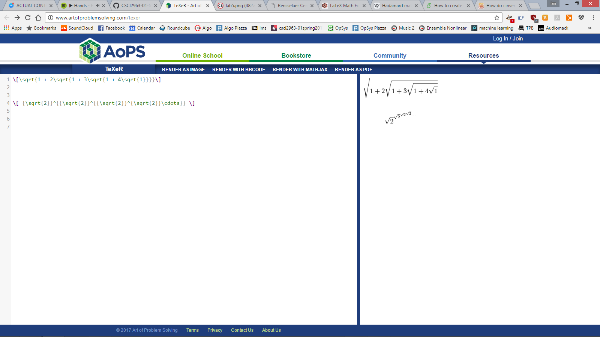

## Name: Ian A. Rios ( Ian) - 
### email: riosi@rpi.edu 

### Lab 4###
0. 2. latex 

1.	i.	Projects: pyLemma, Remote Academy Laboratory, Reserve With Me, RPI Tours, Second String
	ii. 	| project name 				| number of contributers 	| number of lines of code 	| the first commit 	| the latest commit 		| the current branches 	|
			| pyLemma 					| 4   						|							|  					| edggy - 172 days ago 		| master				|
			| Remote Academy Laboratory | 3   						| 							|  					| gitcole - 2 days ago		| myBranch				|
			| Reserve With Me 			| 1   						| 							| 					| NONstiky - 10 days ago	| master				|
			| RPI Tours 				| 9   						| 							| 					| JohnBehnke - 151 days ago | develop				|
			| Second String 			| 5   						| 							| 					| fcusano9 - 2 days ago 	| master				|